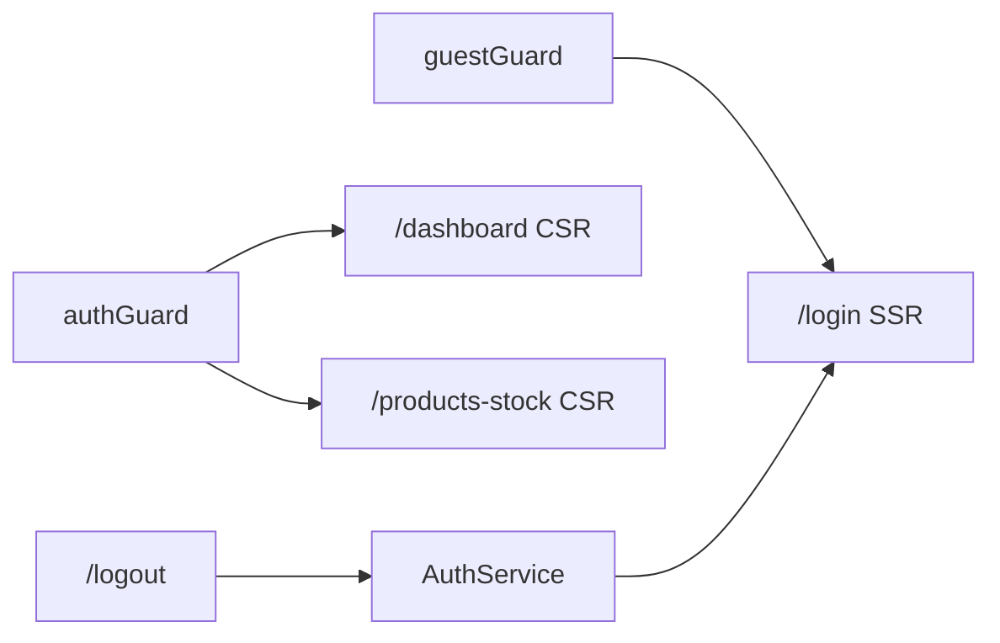

# Plan: ekran logowania (Figma #26/#27) + hybrydowe SSR

**Figma:** [DashStack — ekrany #26 / #27](https://www.figma.com/design/x71HmDnhv7Hl8JR6gcCBYk/DashStack---Free-Admin-Dashboard-UI-Kit---Admin---Dashboard-Ui-Kit---Admin-Dashboard--Community-?node-id=0-1945)

**Zakres:** mock auth (serwis + guardy + session w `sessionStorage`), SSR głównie dla trasy `/login` (reszta aplikacji CSR).

---

## Kontekst

- Aplikacja jest dziś **CSR-only** (`package.json` — brak `@angular/ssr`, `main.ts` używa `bootstrapApplication`).
- Brak modułu auth; sidebar jest zawsze w `app.html`; „Logout” w menu prowadzi do nieistniejącej trasy `/logout`.
- Stylowanie: Material M3 + tokeny CSS w `styles.scss` (`--kpi-blue: #4880ff`, `--bg-primary`, `--bg-card`).

---

## Checklist implementacji

- [ ] Dodać `@angular/ssr`, `app.routes.server.ts` (login=Prerender, `**`=Client), skrypty `start:ssr` / `build:ssr`
- [ ] `AuthService` (mock + sessionStorage), typ `AuthSession`, `authGuard` + `guestGuard` + logout
- [ ] `LoginPage`: reactive form, Material fields, SCSS karty zgodny z Figmą #26/#27, dark via `ThemeService`
- [ ] Trasy login/logout, guardy na dashboard/products-stock, ukrycie sidebara na `/login`
- [ ] Vitest: service/guards/login-page; Playwright: flow login/logout/redirect

---

## Docelowy układ (Figma DashStack #26 / #27)

Ekrany #26 (light) i #27 (dark) to ten sam layout — różni się tylko motyw. Istniejący `ThemeService` + `html.dark-theme` pokryją #27 bez osobnego komponentu.

```mermaid
flowchart TB
  subgraph loginPage [LoginPage - full viewport]
    Logo[DashStack logo]
    Title[Login to account]
    Subtitle[Please enter email and password]
  Form[Reactive form: email + password]
  Row[Remember me | Forgot password]
  Btn[Sign in - primary blue]
  end
```

**Elementy UI do odwzorowania** (weryfikacja spacingu/tekstów w Figmie podczas implementacji):

| Element | Wskazówka ze stylów projektu |
|---------|------------------------------|
| Tło strony | `var(--bg-primary)` |
| Karta logowania | `var(--bg-card)`, `border-radius: 12px`, cień subtelny, `border: 1px solid var(--border-color)` |
| Logo | jak sidebar: `logo-text`, `#4880ff`, Nunito Sans 800 |
| Pola | `mat-form-field appearance="outline"` (wzorzec z `products-stock-toolbar.html`) |
| Przycisk Sign in | `mat-flat-button` + override `.login-button` na `var(--kpi-blue)` (jak `.add-product-button`) |
| Link Forgot password | `var(--kpi-blue)`, focus visible |
| Remember me | `mat-checkbox` |

Strona **bez** `app-page-content` i **bez** sidebara (pełna szerokość viewport).

---

## Architektura routingu i layoutu



### Zmiany w routingu — `app.routes.ts`

| Trasa | Guard | Render |
|-------|-------|--------|
| `login` | `guestGuard` (jeśli zalogowany → `dashboard`) | **Server / Prerender** |
| `dashboard`, `products-stock` | `authGuard` | **Client** |
| `logout` | — | redirect + `AuthService.logout()` |
| `''` | — | redirect do `dashboard` (guard przekieruje na login) |
| `**` | — | redirect do `dashboard` |

Nowy feature: `src/app/features/auth/` (lazy `loadChildren`).

### Shell bez sidebara na loginie

Refaktor `app.html` / `app.ts`:

- `computed` `showSidebar` na podstawie `Router` events / `router.url` — sidebar tylko gdy trasa **nie** zaczyna się od `/login`.
- Alternatywa (czystsza): osobny `AppShellComponent` z dwoma `<router-outlet>` layoutami — na tę iterację wystarczy warunkowe `@if (showSidebar())` w root.

---

## 1. Infrastruktura SSR (hybrydowa)

**Krok:** `ng add @angular/ssr` (Angular 21) — doda m.in.:

- `@angular/ssr`, `@angular/platform-server`
- `src/server.ts`, `src/app/app.config.server.ts`
- target `serve:ssr` / `build` z opcją `ssr` w `angular.json`

**Konfiguracja hybrydowa** (tylko `/login` po stronie serwera):

Nowy plik `src/app/app.routes.server.ts`:

```typescript
import { RenderMode, ServerRoute } from '@angular/ssr';

export const serverRoutes: ServerRoute[] = [
  { path: 'login', renderMode: RenderMode.Prerender }, // statyczny HTML przy buildzie
  { path: '**', renderMode: RenderMode.Client },       // dashboard, products-stock = CSR
];
```

Podłączenie w `app.config.server.ts` przez `provideServerRendering(withRoutes(serverRoutes))`.

**Uzasadnienie `Prerender` dla loginu:** strona jest publiczna i w dużej mierze statyczna; szybszy TTFB niż CSR, bez konieczności SSR całego panelu. Jeśli wolisz render na żądanie — zamiana na `RenderMode.Server`.

**Skrypty npm** (aktualizacja `package.json`):

- `start:ssr` — `ng serve` z SSR (dev)
- `build:ssr` — produkcyjny build z SSR
- E2E: w `playwright.config.ts` opcjonalnie `webServer.command` na `npm run start:ssr` **tylko** dla testów loginu (lub osobny projekt Playwright)

> **Uwaga:** guardy oparte na `sessionStorage` działają po hydratacji po stronie klienta — to oczekiwane przy mock auth bez cookies.

---

## 2. Feature `auth` — struktura plików

```
src/app/features/auth/
  auth.routes.ts
  pages/login-page/
    login-page.ts | .html | .scss | .spec.ts
  services/
    auth.service.ts | .spec.ts
  guards/
    auth.guard.ts
    guest.guard.ts
src/app/types/
  auth-session.interface.ts   # zgodnie z AGENTS.md
```

### `AuthService` (mock, signals)

- Stan: `isAuthenticated = signal(false)`, opcjonalnie `user = signal<AuthUser | null>(null)`.
- Klucz sesji: `sessionStorage` (`app-auth-session`) — JSON z emailem i timestampem.
- `login(email, password)`: walidacja formularza + reguły mock:
  - poprawny format email,
  - hasło min. 6 znaków,
  - opcjonalnie stałe demo: `admin@dashstack.com` / `admin123` (łatwe E2E).
- `logout()`: czyści storage + `isAuthenticated.set(false)`.
- `restoreSession()`: wywołane w `APP_INITIALIZER` lub konstruktorze serwisu — odtwarza sesję po odświeżeniu (tylko browser; na serwerze no-op).

### Guardy

- **`authGuard`**: `inject(AuthService).isAuthenticated()` → `router.createUrlTree(['/login'])`.
- **`guestGuard`**: odwrotnie → `dashboard`.

Funkcyjne guardy (`CanActivateFn`) zgodne z Angular 21.

### Trasa logout

W `auth.routes.ts` lub `app.routes.ts`:

```typescript
{ path: 'logout', redirectTo: 'login', pathMatch: 'full', canActivate: [logoutGuard] }
```

`logoutGuard` wywołuje `authService.logout()` przed redirectem.

---

## 3. Komponent `LoginPage`

**Technologie:** standalone, `OnPush`, `ReactiveFormsModule`, Material (`MatFormFieldModule`, `MatInputModule`, `MatButtonModule`, `MatCheckboxModule`, `MatProgressSpinnerModule`).

**Formularz:**

```typescript
this.form = this.fb.nonNullable.group({
  email: ['', [Validators.required, Validators.email]],
  password: ['', [Validators.required, Validators.minLength(6)]],
  rememberMe: [false],
});
```

- `rememberMe` — na razie UX-only (mock); ewentualnie później `localStorage` vs `sessionStorage`.
- Submit: `authService.login()` → sukces: `router.navigate(['/dashboard'])`; błąd: komunikat `role="alert"` + focus na pierwszym invalid polu.
- Loading: `mat-spinner` na przycisku / disabled state podczas `login()` (symulacja `delay(300)` opcjonalnie).

**Dostępność (WCAG AA):**

- `<main>` + `aria-labelledby` na nagłówku,
- jawne `mat-label` / `aria-describedby` dla błędów,
- kontrast linków i przycisku z tokenami projektu,
- obsługa klawiatury (Enter submit, focus trap niepotrzebny na prostej karcie).

**SCSS** (`login-page.scss`):

- `.login-page`: `min-height: 100vh`, flex center, `background: var(--bg-primary)`.
- `.login-card`: max-width ~420px, padding 32–40px, tokeny karty.
- Responsywność: padding boczny 16px na mobile.

---

## 4. Integracja z resztą aplikacji

| Plik | Zmiana |
|------|--------|
| `app.routes.ts` | `login` lazy, `canActivate: [authGuard]` na feature routes |
| `app.config.ts` | `provideHttpClient` — **nie** na tę iterację |
| `navigation-sidebar-menu.ts` | `Logout` → `/logout` (już jest; guard obsłuży) |
| Domyślny redirect | Zachować `dashboard`; `authGuard` przekieruje niezalogowanych na `/login` |

---

## 5. Testy

### Unit (Vitest)

- `auth.service.spec.ts` — login sukces/błąd, restore session, logout.
- `auth.guard.spec.ts` / `guest.guard.spec.ts` — `TestBed` + mock `AuthService`.
- `login-page.spec.ts` — render formularza, walidacja, submit wywołuje serwis.

### E2E (Playwright)

Nowy plik `e2e-tests/auth/login.spec.ts`:

- Niezalogowany użytkownik na `/dashboard` → redirect `/login`.
- Poprawne dane demo → `/dashboard` + widoczny sidebar.
- Błędne hasło → komunikat błędu.
- Logout z menu → powrót na `/login`.
- Opcjonalnie: snapshot HTML `/login` (SSR/prerender) — `page.content()` zawiera nagłówek przed hydratacją.

---

## Kolejność implementacji

1. `ng add @angular/ssr` + `app.routes.server.ts` (hybryda).
2. Typy + `AuthService` + guardy.
3. `LoginPage` (UI Figma #26/#27).
4. Routing + ukrycie sidebara + `/logout`.
5. Testy unit + E2E + aktualizacja skryptów npm / Playwright.

---

## Ryzyka i ograniczenia

| Ryzyko | Mitygacja |
|--------|-----------|
| Guardy + `sessionStorage` nie działają na serwerze | Prerender loginu jest OK; protected routes = CSR + redirect po hydratacji |
| Budżet stylów komponentu (8kB w prod) | Utrzymać SCSS zwięzły, bez duplikacji `.state-*` z innych stron |
| Playwright vs CSR dev server | Testy loginu uruchamiać na `start:ssr` lub build + `serve:ssr` |
| Różnice spacingu vs Figma | Podczas PR porównać z linkiem Figmy powyżej |

---

## Poza zakresem (kolejna iteracja)

- Prawdziwe API / JWT / cookies (SSR-friendly auth).
- Forgot password / Sign up (jeśli są w Figmie jako osobne ekrany).
- SSR dla dashboardu i pozostałych tras.
